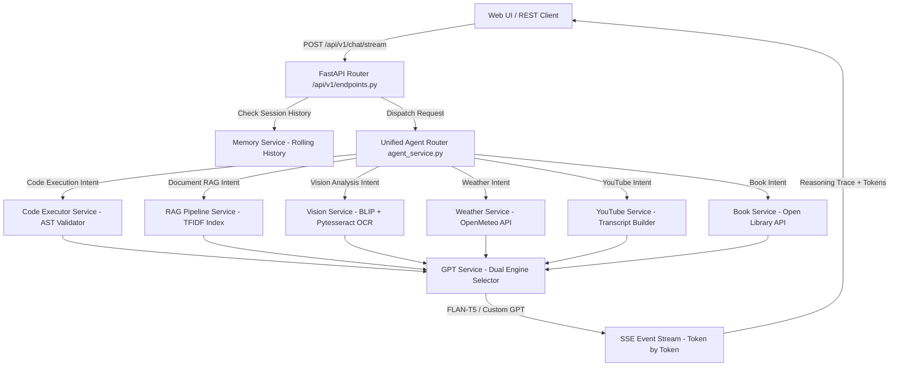

# ⚡ FLASH AI — Enterprise Multi-Modal Generative AI Platform (v1.0.0)

[](https://fastapi.tiangolo.com/)
[](https://pytorch.org/)
[](https://huggingface.co/)
[](LICENSE)

An agentic, multi-modal generative AI platform built with **FastAPI**, **HuggingFace Transformers**, **PyTorch**, and **scikit-learn**. FLASH AI provides real-time vision scene analysis, multi-pass OCR, AST-validated sandboxed code execution, neural document summarization, TF-IDF RAG vector indexing, live weather forecasts, YouTube study note generation, and streaming Server-Sent Events (SSE) chat with transparent reasoning traces.

---

## 📌 Table of Contents
1. [Project Overview](#-project-overview)
2. [Architecture & System Flow](#-architecture--system-flow)
3. [Core Feature Matrix](#-core-feature-matrix)
4. [Component & Module Breakdown](#-component--module-breakdown)
5. [Tech Stack & Dependencies](#-tech-stack--dependencies)
6. [Prerequisites & Local Installation](#-prerequisites--local-installation)
7. [API Endpoints & Usage Examples](#-api-endpoints--usage-examples)
8. [Folder Structure](#-folder-structure)
9. [License](#-license)

---

## 🚀 Project Overview

FLASH AI is designed to combine low-latency local machine learning models with external tools into a single autonomous agent platform:
- **Dual Reasoning Engines**: Toggle between `FLASH Reasoning Engine` (Instruction-tuned `google/flan-t5-small`) and `Custom PyTorch GPT` (character-level transformer trained from scratch).
- **AST-Validated Python Sandbox**: Safely evaluates mathematical and programmatic expressions inside isolated processes with AST syntax inspection and 5-second process timeouts.
- **Multimodal Vision & Multi-Pass OCR**: Generates non-repeating image scene captions via HuggingFace `Salesforce/blip-image-captioning-base` and extracts text from images using multi-pass thresholding with `pytesseract`.
- **Deep Document Ingestion & RAG**: Extracts clean body text from HTML (using `BeautifulSoup4`), PPTX, DOCX, and PDF files, computes TF-IDF vector indices with stopword filtering, and generates neural summaries.
- **Real-Time Tool Chaining**: Seamlessly chains live weather data (Open-Meteo API), YouTube transcripts, Open Library book data, and Python execution in a single conversation turn with 1-line accordion reasoning traces.

---

## 🏗️ Architecture & System Flow



---

## ⚡ Core Feature Matrix

| Feature | Description | Engine / Library Used |
| :--- | :--- | :--- |
| **Dual Chat Brain** | Toggle between instruction model & PyTorch GPT | `google/flan-t5-small` / PyTorch |
| **Sandboxed Code Executor** | AST pre-execution safety inspection + timeout | `ast.NodeVisitor`, Subprocess (`python -I`) |
| **Vision Scene Captioning** | Non-repeating caption generation | `Salesforce/blip-image-captioning-base` |
| **Multi-Pass OCR** | Grayscale, binary & inverted threshold OCR | `pytesseract` + `PIL` |
| **HTML / Doc Parsing** | Clean page body extraction without `<title>` noise | `BeautifulSoup4` (`bs4`), `pypdf`, `python-pptx` |
| **RAG Vector Search** | Keyword & TF-IDF similarity with citations | `scikit-learn` `TfidfVectorizer` |
| **Live Weather & Geocoding** | Global live temperature and forecast | `Open-Meteo API` |
| **Token SSE Streaming** | Real-time token streaming with reasoning traces | FastAPI `EventSourceResponse` |

---

## 🧩 Component & Module Breakdown

### `app/main.py`
Application entry point. Initializes FastAPI instance, configures CORS middleware, registers global custom exception handlers (`CustomGPTException`), pre-warms AI assets during startup (`lifespan`), and mounts static frontend files.

### `app/api/v1/endpoints.py`
Exposes core API endpoints:
- `POST /api/v1/chat`: Synchronous chat endpoint supporting tool execution, dual model modes, and reasoning trace emission.
- `POST /api/v1/chat/stream`: Server-Sent Events (SSE) token-by-token streaming endpoint.
- `POST /api/v1/upload`: Multimodal document and image file ingestion endpoint.
- `GET /api/v1/health`: System health and model device diagnostics.

### `app/services/`
- **`agent_service.py`**: Central router that identifies user intent, orchestrates tool chaining across services, constructs 1-line reasoning traces, and formats final answers.
- **`gpt_service.py`**: Manages model loading and inference for `FLASH Reasoning Engine` (`google/flan-t5-small`) and `Custom PyTorch GPT`.
- **`code_executor_service.py`**: Inspects Python code AST syntax trees (`SecurityASTValidator`), blocks dangerous imports (`os`, `subprocess`, `sys`, `socket`), and executes safe code in a 5-second isolated subprocess.
- **`vision_service.py`**: Runs HuggingFace BLIP image captioning (`repetition_penalty=1.5`, `no_repeat_ngram_size=3`) and multi-pass `pytesseract` OCR text extraction.
- **`document_service.py`**: Parses body text from HTML (`BeautifulSoup`), PPTX, DOCX, and PDF files, extracts TF-IDF skill keywords, and generates neural FLAN-T5 document summaries.
- **`rag_service.py`**: Indexes uploaded document chunks into TF-IDF vector space for vector search queries with exact source citations.
- **`memory_service.py`**: Manages rolling per-session conversation context keyed by `session_id`.
- **`weather_service.py`**: Queries Open-Meteo Geocoding & Weather APIs for real-time weather reports.
- **`youtube_service.py`**: Fetches YouTube video metadata and generates key study notes.
- **`book_service.py`**: Searches Open Library REST API for book summaries and author metadata.

---

## 🛠️ Tech Stack & Dependencies

- **Language**: Python 3.11+
- **Web Framework**: FastAPI, Uvicorn, Pydantic v2
- **Machine Learning & NLP**: PyTorch, HuggingFace Transformers (`google/flan-t5-small`, `Salesforce/blip-image-captioning-base`), scikit-learn
- **Computer Vision & OCR**: Pillow (PIL), PyTesseract
- **Document & Web Processing**: BeautifulSoup4 (`bs4`), lxml, pypdf, python-pptx, python-docx
- **Frontend**: Vanilla HTML5, CSS3, JavaScript (Fetch API, EventSource)

---

## ⚙️ Prerequisites & Local Installation

### 1. Clone the Repository
```bash
git clone https://github.com/your-username/custom_gpt_platform.git
cd custom_gpt_platform
```

### 2. Set Up Virtual Environment
```bash
python -m venv venv
# On Windows PowerShell:
.\venv\Scripts\Activate.ps1
# On Linux/macOS:
source venv/bin/activate
```

### 3. Install Python Dependencies
```bash
pip install -r requirements.txt
```

### 4. Install Tesseract OCR Binary (Optional for Image OCR)
- **Windows**: Download installer from [UB-Mannheim Tesseract Wiki](https://github.com/UB-Mannheim/tesseract/wiki) and install to `C:\Program Files\Tesseract-OCR\tesseract.exe`.
- **Linux**: `sudo apt-get install tesseract-ocr`
- **macOS**: `brew install tesseract`

### 5. Launch Development Server
```bash
python -m uvicorn app.main:app --host 127.0.0.1 --port 8140 --reload
```
Access the web UI at `http://127.0.0.1:8140`.

---

## 🧪 API Endpoints & Usage Examples

### 1. Synchronous Chat (`POST /api/v1/chat`)
```bash
curl -X POST "http://127.0.0.1:8140/api/v1/chat" \
  -H "Content-Type: application/json" \
  -d '{
    "prompt": "Calculate 10000 * (1 + 0.07)**10 and check weather in Vadodara",
    "engine_mode": "flash_reasoning",
    "session_id": "user_session_1"
  }'
```

### 2. Multimodal File Upload (`POST /api/v1/upload`)
```bash
curl -X POST "http://127.0.0.1:8140/api/v1/upload" \
  -F "file=@/path/to/resume.html"
```

### 3. System Health (`GET /api/v1/health`)
```bash
curl "http://127.0.0.1:8140/api/v1/health"
```

---

## 📂 Folder Structure

```text
custom_gpt_platform/
├── app/
│   ├── api/
│   │   └── v1/
│   │       ├── __init__.py
│   │       └── endpoints.py
│   ├── core/
│   │   ├── config.py
│   │   ├── errors.py
│   │   └── logging.py
│   ├── models/
│   │   └── schemas.py
│   ├── services/
│   │   ├── agent_service.py
│   │   ├── book_service.py
│   │   ├── code_executor_service.py
│   │   ├── document_service.py
│   │   ├── gpt_service.py
│   │   ├── memory_service.py
│   │   ├── rag_service.py
│   │   ├── speech_service.py
│   │   ├── vision_service.py
│   │   ├── weather_service.py
│   │   └── youtube_service.py
│   ├── __init__.py
│   └── main.py
├── frontend/
│   └── index.html
├── scratch/
├── tests/
├── .env.example
├── Dockerfile
├── docker-compose.yml
├── pytest.ini
├── README.md
└── requirements.txt
```

---

## 📄 License
This project is open-source under the [MIT License](LICENSE).
